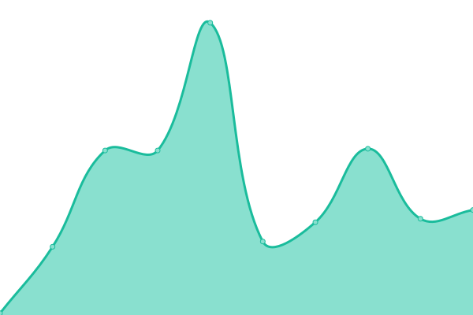
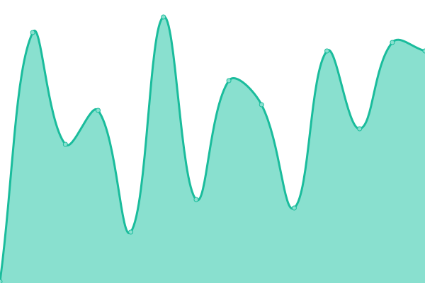
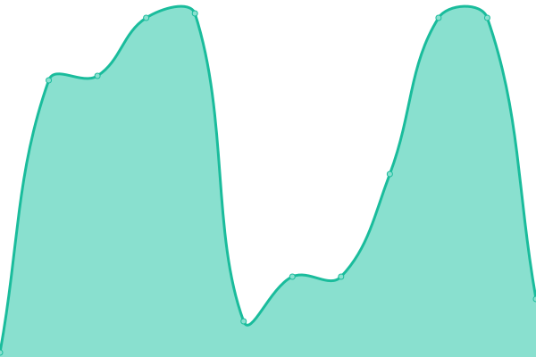
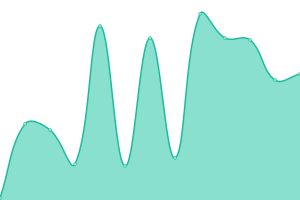
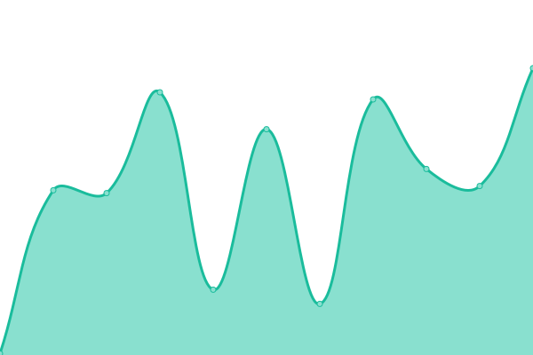
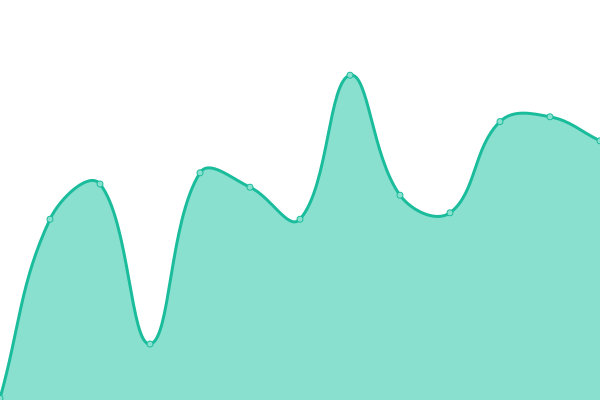

# [📈 Live Status](https://QRjet.github.io/monitor): <!--live status--> **🟧 Partial outage**

This repository contains the open-source uptime monitor and status page for [QRjet](https://QRjet.github.io/monitor), powered by [Upptime](https://github.com/upptime/upptime).

With [Upptime](https://upptime.js.org), you can get your own unlimited and free uptime monitor and status page, powered entirely by a GitHub repository. We use [Issues](https://github.com/QRjet/monitor/issues) as incident reports, [Actions](https://github.com/QRjet/monitor/actions) as uptime monitors, and [Pages](https://QRjet.github.io/monitor) for the status page.

<!--start: status pages-->
<!-- This summary is generated by Upptime (https://github.com/upptime/upptime) -->
<!-- Do not edit this manually, your changes will be overwritten -->
<!-- prettier-ignore -->
| URL | Status | History | Response Time | Uptime |
| --- | ------ | ------- | ------------- | ------ |
|  [[ Web - QA ] Consumer Web App](https://consumer.qa.truetale.io/) | 🟥 Down | [web-qa-consumer-web-app.yml](https://github.com/QRjet/monitor-qa/commits/HEAD/history/web-qa-consumer-web-app.yml) | 

 107ms
     
 | 

<a href="https://QRjet.github.io/monitor-qa/history/web-qa-consumer-web-app">94.73%</a>
    

|  [[ Web - QA ] Admin Web App](https://admin.qa.truetale.io/) | 🟩 Up | [web-qa-admin-web-app.yml](https://github.com/QRjet/monitor-qa/commits/HEAD/history/web-qa-admin-web-app.yml) | 

 121ms
     
 | 

<a href="https://QRjet.github.io/monitor-qa/history/web-qa-admin-web-app">100.00%</a>
    

|  [[ Web - QA ] Partner Web App](https://partner.qa.truetale.io/) | 🟩 Up | [web-qa-partner-web-app.yml](https://github.com/QRjet/monitor-qa/commits/HEAD/history/web-qa-partner-web-app.yml) | 

 173ms
     
 | 

<a href="https://QRjet.github.io/monitor-qa/history/web-qa-partner-web-app">100.00%</a>
    

|  [[ Web - QA ] Brands Web App](https://business.qa.truetale.io/) | 🟩 Up | [web-qa-brands-web-app.yml](https://github.com/QRjet/monitor-qa/commits/HEAD/history/web-qa-brands-web-app.yml) | 

 75ms
     
 | 

<a href="https://QRjet.github.io/monitor-qa/history/web-qa-brands-web-app">100.00%</a>
    

|  [[ Service - QA ] Billing Service](https://api.qa.truetale.io/api/billing/health-check) | 🟥 Down | [service-qa-billing-service.yml](https://github.com/QRjet/monitor-qa/commits/HEAD/history/service-qa-billing-service.yml) | 

 304ms
     
 | 

<a href="https://QRjet.github.io/monitor-qa/history/service-qa-billing-service">94.73%</a>
    

|  [[ Service - QA ] Consumer Service](https://api.qa.truetale.io/api/consumer/health-check) | 🟥 Down | [service-qa-consumer-service.yml](https://github.com/QRjet/monitor-qa/commits/HEAD/history/service-qa-consumer-service.yml) | 

 125ms
     
 | 

<a href="https://QRjet.github.io/monitor-qa/history/service-qa-consumer-service">94.73%</a>
    

|  [[ Service - QA ] Emails Service](https://api.qa.truetale.io/api/emails/health-check) | 🟥 Down | [service-qa-emails-service.yml](https://github.com/QRjet/monitor-qa/commits/HEAD/history/service-qa-emails-service.yml) | 

 42ms
     
 | 

<a href="https://QRjet.github.io/monitor-qa/history/service-qa-emails-service">0.00%</a>
    

|  [[ Service - QA ] Gateway Service](https://api.qa.truetale.io/graphql/health-check) | 🟥 Down | [service-qa-gateway-service.yml](https://github.com/QRjet/monitor-qa/commits/HEAD/history/service-qa-gateway-service.yml) | 

 44ms
     
 | 

<a href="https://QRjet.github.io/monitor-qa/history/service-qa-gateway-service">94.73%</a>
    

|  [[ Service - QA ] Media Service](https://api.qa.truetale.io/api/media/health-check) | 🟥 Down | [service-qa-media-service.yml](https://github.com/QRjet/monitor-qa/commits/HEAD/history/service-qa-media-service.yml) | 

 117ms
     
 | 

<a href="https://QRjet.github.io/monitor-qa/history/service-qa-media-service">94.74%</a>
    

|  [[ Service - QA ] Orders Service](https://api.qa.truetale.io/api/orders/health-check) | 🟥 Down | [service-qa-orders-service.yml](https://github.com/QRjet/monitor-qa/commits/HEAD/history/service-qa-orders-service.yml) | 

 127ms
     
 | 

<a href="https://QRjet.github.io/monitor-qa/history/service-qa-orders-service">94.74%</a>
    

|  [[ Service - QA ] orgAccounts Service](https://api.qa.truetale.io/api/org-accounts/health-check) | 🟥 Down | [service-qa-org-accounts-service.yml](https://github.com/QRjet/monitor-qa/commits/HEAD/history/service-qa-org-accounts-service.yml) | 

 129ms
     
 | 

<a href="https://QRjet.github.io/monitor-qa/history/service-qa-org-accounts-service">94.74%</a>
    

|  [[ Service - QA ] Pim Service](https://api.qa.truetale.io/api/pim/health-check) | 🟥 Down | [service-qa-pim-service.yml](https://github.com/QRjet/monitor-qa/commits/HEAD/history/service-qa-pim-service.yml) | 

 125ms
     
 | 

<a href="https://QRjet.github.io/monitor-qa/history/service-qa-pim-service">94.74%</a>
    

|  [[ Service - QA ] Qr Codes Service](https://api.qa.truetale.io/api/qr-codes/health-check) | 🟥 Down | [service-qa-qr-codes-service.yml](https://github.com/QRjet/monitor-qa/commits/HEAD/history/service-qa-qr-codes-service.yml) | 

 43ms
     
 | 

<a href="https://QRjet.github.io/monitor-qa/history/service-qa-qr-codes-service">94.74%</a>
    

|  [[ Service - QA ] Reseller Service](https://api.qa.truetale.io/api/reseller/health-check) | 🟥 Down | [service-qa-reseller-service.yml](https://github.com/QRjet/monitor-qa/commits/HEAD/history/service-qa-reseller-service.yml) | 

 120ms
     
 | 

<a href="https://QRjet.github.io/monitor-qa/history/service-qa-reseller-service">94.74%</a>
    

|  [[ Service - QA ] Shopify Listener Service](https://api.qa.truetale.io/api/shopify-adapter-event-listener/health-check) | 🟥 Down | [service-qa-shopify-listener-service.yml](https://github.com/QRjet/monitor-qa/commits/HEAD/history/service-qa-shopify-listener-service.yml) | 

 43ms
     
 | 

<a href="https://QRjet.github.io/monitor-qa/history/service-qa-shopify-listener-service">94.74%</a>
    

|  [[ Service - QA ] Shopify Sync](https://api.qa.truetale.io/api/shopify-adapter-sync/health-check) | 🟥 Down | [service-qa-shopify-sync.yml](https://github.com/QRjet/monitor-qa/commits/HEAD/history/service-qa-shopify-sync.yml) | 

 129ms
     
 | 

<a href="https://QRjet.github.io/monitor-qa/history/service-qa-shopify-sync">94.74%</a>
    

|  [[ Service - QA ] Tags](https://api.qa.truetale.io/api/tags/health-check) | 🟥 Down | [service-qa-tags.yml](https://github.com/QRjet/monitor-qa/commits/HEAD/history/service-qa-tags.yml) | 

 121ms
     
 | 

<a href="https://QRjet.github.io/monitor-qa/history/service-qa-tags">94.74%</a>
    

|  [[ Service - QA ] Templates](https://api.qa.truetale.io/api/templates/health-check) | 🟥 Down | [service-qa-templates.yml](https://github.com/QRjet/monitor-qa/commits/HEAD/history/service-qa-templates.yml) | 

 116ms
     
 | 

<a href="https://QRjet.github.io/monitor-qa/history/service-qa-templates">94.74%</a>
    

|  [[ Service - QA ] Widgets](https://api.qa.truetale.io/api/widgets/health-check) | 🟥 Down | [service-qa-widgets.yml](https://github.com/QRjet/monitor-qa/commits/HEAD/history/service-qa-widgets.yml) | 

 118ms
     
 | 

<a href="https://QRjet.github.io/monitor-qa/history/service-qa-widgets">94.74%</a>
    

|  [[ Service - QA ] Admin](https://api.qa.truetale.io/api/admin/health-check) | 🟩 Up | [service-qa-admin.yml](https://github.com/QRjet/monitor-qa/commits/HEAD/history/service-qa-admin.yml) | 

 120ms
     
 | 

<a href="https://QRjet.github.io/monitor-qa/history/service-qa-admin">94.74%</a>
    

<!--end: status pages-->

[**Visit our status website →**](https://QRjet.github.io/monitor)

## 📄 License

- Powered by: [Upptime](https://github.com/upptime/upptime)
- Code: [MIT](./LICENSE) © [QRjet](https://QRjet.github.io/monitor)
- Data in the `./history` directory: [Open Database License](https://opendatacommons.org/licenses/odbl/1-0/)
